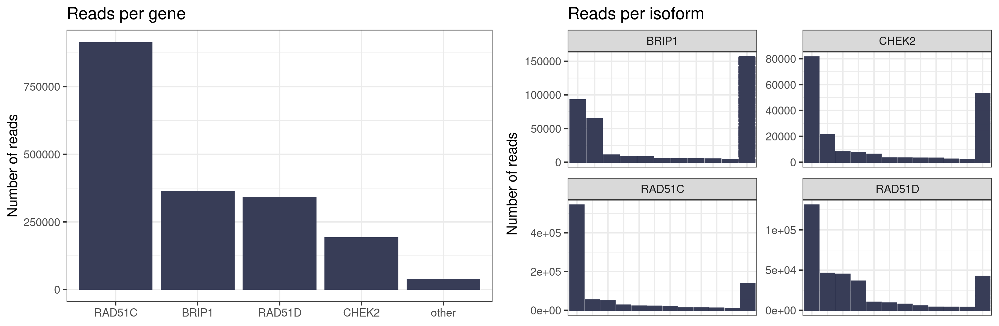
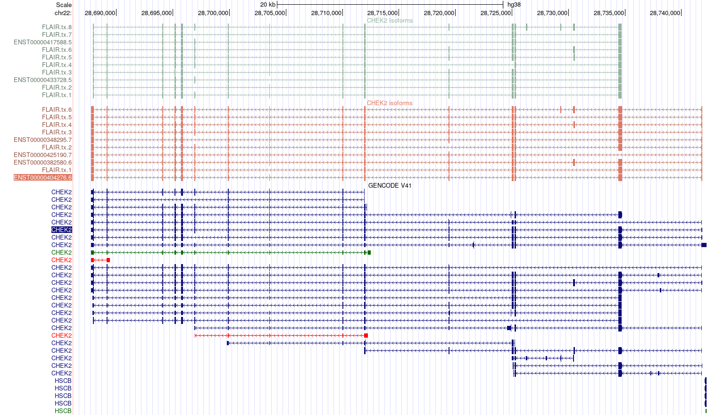
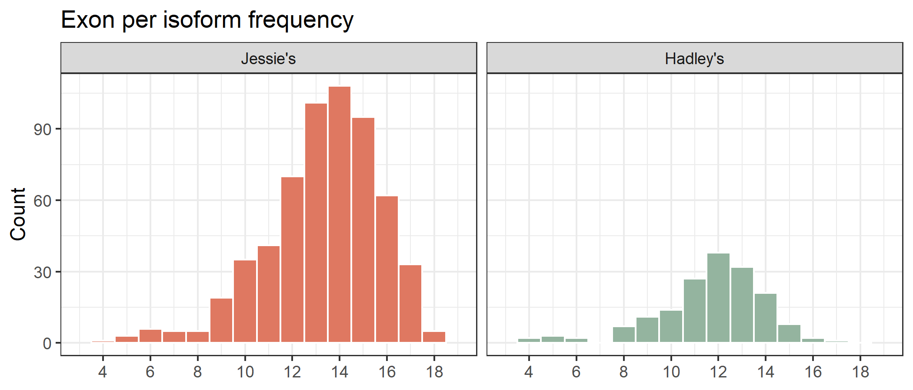
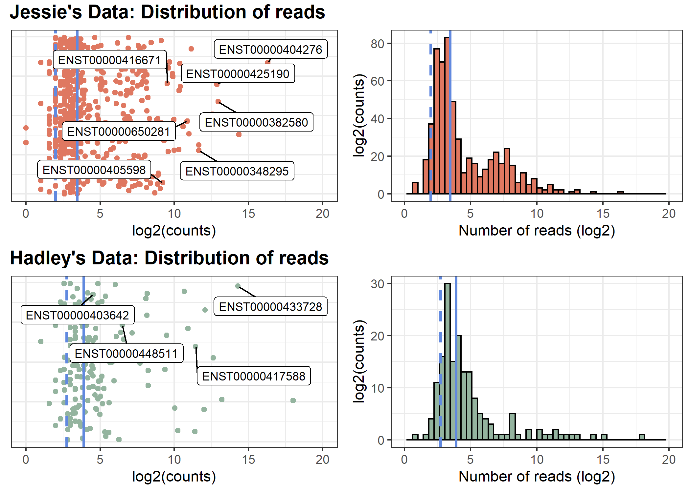
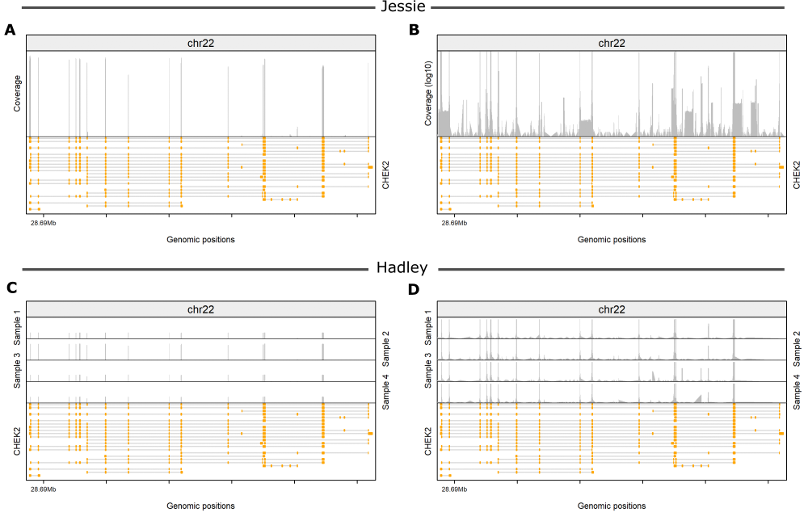

<nav class="toc-fixed" markdown="1">
* TOC
{:toc}
</nav>

## Background
The aim of this project is to catalogue <em>CHEK2</em> RNA isoforms using multiple molecular platforms, inlcuding short/long-read sequencing, RT-qPCR and capillary  electrophoresis.

This project will include many collaborators, with my/our focus on using the Nanopore sequencing data to identify known and novel RNA isoforms. 
We also have some short-read sequecning data done by Dr Vaneesa Lau which we can use to look at junction abundance.

## Nanopore data
There are two long-read sequencing projects that have *CHEK2* data:
- Jessie Cheng generated data during her summer studentship in 2019 on four genes (*BRIP1, RAD51C, RAD51D* and *CHEK2*). This sequencing data was generate on the MinION (see table) and the data was stored on Otago's high capcity storage (`GSFL/Jessie/10th run`). There is an issue with Jessie's fastq files generated by Guppy- *I suspect there was a interuption during the copy* as only a 10th of the data is in the `pass` directory generated by Guppy. For this reason I will try recall these bases using the gridION.
- Hadley Northcott generated data during his PhD studies in 2022. He sequenced the four PCR amplicons across *CDH1, CHEK2, PALB2* and *PTEN* and *PTEN* genes. Five samples (PatientID: 18987, 17137, 17069, 18987 and 17905) were assessed and barcoded with barcode 91-95 for multiplex sequecning. The data for which is located on Otago's high capcity storage (`mcrg/Hadley/hn_20012022_flttissue`).

<table>
    <tr>
        <th colspan="3">Sequencing Statistics</th>
    </tr>
    <tr>
        <td></td>
        <td>Jessie</td>
        <td>Hadley</td>
    </tr>
    <tr>
        <td>Flow cell ID</td>
        <td>FAK22539</td>
        <td>FAQ10897</td>
    </tr>
    <tr>
        <td>Flow cell product code</td>
        <td>FLO-MIN106</td>
        <td>FLO-MIN106</td>
    </tr>
    <tr>
        <td>Kit ID</td>
        <td>SQK-LSK109</td>
        <td>SQK-LSK109</td>
    </tr>
    <tr>
        <th colspan="3">Run Statistics</th>
    </tr>
        <tr>
        <td>Number of reads</td>
        <td>6.93 million</td>
        <td>6.79 million</td>
    </tr>
    <tr>
        <td>Number of bases</td>
        <td>10.87 Gb</td>
        <td>6.37</td>
    </tr>
    <tr>
        <td>Fast5 - Number of files</td>
        <td>1733</td>
        <td>1709</td>
    </tr>
    <tr>
        <td>Fast5 - Size of files</td>
        <td>184G </td>
        <td>117</td>
    </tr>
</table>


### Guppy basecalling

`guppy-basecaller` is installed on the gridION and with the minKNOW software can be called - however this appeared to cause fatal errors (the computer would crash) - this happened independently for Allison and I on two separate projects. *My guess is the config files don't match either the flow cell or kit.*

However, the basecaller can be called through command line prompt and with the right settings run. The major thing is to match the kit and flow-cell with a config file.
> I suspect that each parameter of the config file can be passed into the command independently - but I have not tested this.

To find avaliable config files: 
```bash
guppy_basecaller --print_workflows
```
> Note I am unsure if the config paths need to be explicit. If so these are located in `/opt/ont/guppy/data/`

To run the base caller only a path to fast5 files, an output file and config file are necessary. However, this will run in CPU mode which is significantly slower than GPU mode. There are options to increase the number of threads (`--cpu_threads_per_caller`, `num_callers`) but even maxed out this wouldn't compare in speed. 
```bash
configPath=/opt/ont/guppy/data # path to config file
guppy_basecaller -i fast5/ -s basecalls/ -c $configPath/[configFile] # minimal example [CPU mode]
guppy_basecaller -i fast5/ -s basecalls/ -c $configPath/[configFile] -x <cuda:device_id> # minimal example [GPU mode]
```
> To find the graphic card id and cuda device id you can run `nvidia-smi` - this requires the NVIDIA drivers to be installed, which will be on the gridION box. 

```
Tue Aug  9 04:17:32 2022       
+-----------------------------------------------------------------------------+
| NVIDIA-SMI 495.44       Driver Version: 495.44       CUDA Version: 11.5     |
|-------------------------------+----------------------+----------------------+
| GPU  Name        Persistence-M| Bus-Id        Disp.A | Volatile Uncorr. ECC |
| Fan  Temp  Perf  Pwr:Usage/Cap|         Memory-Usage | GPU-Util  Compute M. |
|                               |                      |               MIG M. |
|===============================+======================+======================|
|   0  NVIDIA GeForce ...  Off  | 00000000:01:00.0  On |                  N/A |
| 20%   44C    P2    60W / 250W |   2821MiB / 11175MiB |      0%      Default |
|                               |                      |                  N/A |
+-------------------------------+----------------------+----------------------+
|   1  NVIDIA GeForce ...  Off  | 00000000:02:00.0 Off |                  N/A |
| 20%   28C    P8     8W / 250W |    212MiB / 11178MiB |      0%      Default |
|                               |                      |                  N/A |
+-------------------------------+----------------------+----------------------+
                                                                               
+-----------------------------------------------------------------------------+
| Processes:                                                                  |
|  GPU   GI   CI        PID   Type   Process name                  GPU Memory |
|        ID   ID                                                   Usage      |
|=============================================================================|
|    0   N/A  N/A       871      C   ...bin/guppy_basecall_server     2504MiB |
|    0   N/A  N/A      2041      G   /usr/lib/xorg/Xorg                 35MiB |
|    0   N/A  N/A      3258      G   /usr/lib/xorg/Xorg                110MiB |
|    0   N/A  N/A      3384      G   /usr/bin/gnome-shell               46MiB |
|    0   N/A  N/A      6805      G   /usr/lib/firefox/firefox           98MiB |
|    1   N/A  N/A       871      C   ...bin/guppy_basecall_server      199MiB |
|    1   N/A  N/A      2041      G   /usr/lib/xorg/Xorg                  4MiB |
|    1   N/A  N/A      3258      G   /usr/lib/xorg/Xorg                  4MiB |
+-----------------------------------------------------------------------------+
```

```bash
## Recalling Jessie's fast5 files
configPath=/opt/ont/guppy/data # path to config file
cp -r /media/gsfl/Jessie/10th_run/fast5 /data/Jessie/Jessie 10th run/  # move files from HCS to local machine
guppy_basecaller --compress_fastq --min_qscore 7 -x 'cuda:0' -i fast5/ -s basecalls/ -c $configPath/dna_r9.4.1_450bps_hac.cfg # basecalling, compress fastq files and only pass reads with qscore > 7
```
Hadley's data was called with no issue originally. There is a slight difference with the read quality threshold  was increased to 9 and demultiplexing was run. - There is some legacy reasons for the difference in `min_qscore` with default minimum increasing in later minKNOW releases. A large portion of the reads (~2.5 gb) were not assigned to a barcode/sample. 
<table>
    <tr>
        <th colspan="3">Base calling</th>
    </tr>
    <tr>
        <td></td>
        <td>Jessie</td>
        <td>Hadley (5 Samples</td>
    </tr>
    <tr>
        <td>Setting</td>
        <td>--compress_fastq --min_qscore 7</td>
        <td></td>
    </tr>
        <tr>
        <td>Fastq reads passed</td>
        <td>6,293,283</td>
        <td>321,310|748,167|572,053|513,401|723,988</td>
    </tr>
    <tr>
        <td>Fastq reads failed</td>
        <td>632,902</td>
        <td>23,335|84,517|58,586|54,050|102,663</td>
    </tr>
</table>

## Mapping
For both data sets the mapping, and the subsequent steps, the [FLAIR (v.1.5.1) pipeline](https://github.com/BrooksLabUCSC/flair) will be used. The `align` step uses `minimap2` with splice aware options - alternatively this could be run directly.
All scripts used are on [my github](https://github.com/wigge206/CHEK2_RNAisoforms) including:
- concat_fq.sh
- align.sh
- correct.sh
- collapse.sh
- quantify.sh

### Concatanate
Before running flair, all sample fastq files can be concatanated. This is not necessary as all the fastq files can be listed  after the `-r` option, but for aligance/ease to read I prefer to concatanate. 
```bash
## For multiple barcoded samples - Hadley's data
path=/WORKSPACE/George/Hadley_nanoporeData/20220120_1103_X5_FAQ10897_08340024/fastq_pass/
outPath=/WORKSPACE/George/CHEK2_RNAisoforms/reads/concatanted_reads/
cd $outPath/Hadley
for file in $path/barcode9*
do
  out=`basename $file`
  cat $file/*fastq.gz > $out".fastq.gz"
done
```
Once reads were merged these were mapped to **hg38 primary assembly** downloaded from gencode. The script used on [my github (scripts/align.sh)](https://github.com/wigge206/CHEK2_RNAisoforms/blob/main/scripts/align.sh) which followes the general align option with a minimum MAPQ score of 30.
```bash
## General flair align
python flair align -g [path/to/genome.fa] -r [/path/to/concat.fq.gz] -v1.3 --quality 30 -o [outfileBasename]
```

## Correct
To correct slight errors in splice junction, flair uses known anntataions to adjust alignments. The aligned bed files were corrected using the  gencode **version 41** anntations (hg38 build). The script used for this project is on [my github (scripts/correct.sh)](https://github.com/wigge206/CHEK2_RNAisoforms/blob/main/scripts/correct.sh).
```bash
## General flair correct
python flair correct -q [path/to/aligned.bed] -g [path/to/genome.fa] -f [path/to/annotation.gtf] -o [outfileBasename]
```
Once bed files were corrected, all samples from Hadley's data were merged to generate a bed file that will be used to make a 'master' annotation file. 

## Collapse
This step of flair uses the annotation generated by correct to define RNA isoforms. Reads a collapsed based on matching intron-chains. The gencode **version 41** anntations (hg38 build) are also include to identify known isoforms. See  [scripts/collapse.sh](https://github.com/wigge206/CHEK2_RNAisoforms/blob/main/scripts/collapse.sh) for the my code.
```bash
## General flair correct
python flair collapse -g [path/to/genome.fa] -r [/path/to/concat.fq.gz] -f [path/to/annotation.gtf] -o [outfileBasename]
```

## Quantify
This step of use the high-qualtiy isoforms generated during the collapse step and counts the number of reads mapped to each isoform. This requires the generation of a manifest file which assigns samples to batches (this information is more useful for diffExp and diffSplice application - not suitable for this data) See  [scripts/quantify.sh](https://github.com/wigge206/CHEK2_RNAisoforms/blob/main/scripts/quantify.sh) for the exact code used.
```bash
## General flair correct
python flair quantify -r [/path/to/manifestFile.tsv] -i [path/to/collapse.fa] -o [outfileBasename]
```

**Example manifest.tsv**
```
sample1 conditionA  batch1  path/to/sample1_reads.fq
sample2 conditionA  batch1  path/to/sample2_reads.fq
sample3 conditionA  batch2  path/to/sample3_reads.fq
sample4 conditionB  batch1  path/to/sample4_reads.fq
sample5 conditionB  batch1  path/to/sample5_reads.fq
```


# Results

## Overview: read alignments
THe single LCL Jessie sequence had 3,973,018 reads that map to 9,997 features (RNA isoforms). The vast majority of reads map to no known genes (2,116,898) - these RNA are mapping to chromosome just not within gene boundaries.

Hadley's data is a bit of mess with very low reads for *CDH1* and *PALB2*. Luckily, there is better read coverage for *CHEK2*. However, sample5 (Barcode 95) had no reads. For that reason I will exlcude Sample 5 from further analysis.

<table style="float:left; width:35%; margin-right: 5%;">
    <tr>
        <th colspan="2" style="text-align:center">Jessie's: RNA isoform calling</th>
    </tr>
    <tr>
        <th>Feature</th>
        <th>Number of reads</th>
    </tr>
    <tr>
        <td>Unknown gene</td>
        <td>2,116,898</td>
    </tr>
    <tr>
        <td>RAD51C</td>
        <td>914,417</td>
    </tr>
    <tr>
        <td>BRIP1</td>
        <td>364,369</td>
    </tr>
    <tr>
        <td>RAD51D</td>
        <td>342,505</td>
    </tr>
    <tr>
        <td>CHEK2</td>
        <td>194,066</td>
    </tr>
    <tr>
        <td>Misc. genes</td>
        <td>&lt; 10,000</td>
    </tr>
</table>

<table style="float:right; width:60%">
    <tr>
        <th colspan="7" style="text-align:center">Hadly's: RNA isoform calling</th>
    </tr>
    <tr>
        <th>Feature</th>
        <th></th>
        <th colspan="5" style="text-align:center">Number of reads</th>
    </tr>
    <tr>
        <td></td>
        <td>Sample 1</td>
        <td>Sample 2</td>
        <td>Sample 3</td>
        <td>Sample 4</td>
        <td>Sample 5</td>
        <td>Sample Avg</td>
    </tr>
    <tr>
        <td>Unknown</td>
        <td>43,332</td>
        <td>322,664</td>
        <td>299,216</td>
        <td>275,773</td>
        <td>687,508</td>
        <td>325,699</td>
    </tr>
    <tr>
        <td>CDH1</td>
        <td>456</td>
        <td>1,814</td>
        <td>3</td>
        <td>99</td>
        <td>2</td>
        <td>475</td>
    </tr>
    <tr>
        <td>CHEK2</td>
        <td>60,898</td>
        <td>169,481</td>
        <td>69,354</td>
        <td>64,382</td>
        <td>0</td>
        <td>72,823</td>
    </tr>
    <tr>
        <td>PALB2</td>
        <td>12,313</td>
        <td>4,820</td>
        <td>0</td>
        <td>0</td>
        <td>0</td>
        <td>3,427</td>
    </tr>
    <tr>
        <td>PTEN</td>
        <td>200,441</td>
        <td>201,507</td>
        <td>169,626</td>
        <td>136,301</td>
        <td>0</td>
        <td>141,575</td>
    </tr>
</table>


Each of Jessie's and Hadley's sequencing run was with multiple PCR products. There was however, a bias towards one gene (e.g. For Jessie 50% of reads mapped to genes of interest mapped to *RAD51C*). These differences are likely due to no attempt in have equal molar amounts of each sample and PCR product on the run - this is my assumption. 

<div class="general-img">

    <div class="caption">
    Number of reads mapping to each study-specific gene for Jessie's (A) and Hadley's (B) data, respectively.
    </div>
</div>

## CHEK2 isoforms

The complete list of isoform (novel and known) that mapped to CHEK2 are located in the [data folder](https://github.com/wigge206/RNA-isoforms-chek2/tree/main/data) of the github mian branch. Similarly, there is a tab-separated file with number of reads for each isoform.
In total, there are four files - two for each data set. 
> Note: As the counts require re-mapping there is the chane that reads can be mapped to other known isoforms. This happened for one read in Jessies data.

```bash
## grep each geneID
grep ENSG00000183765 jessieRun10.isoforms.bed > chek2_jessieRun10.isoforms.bed
## for count file I want to keep header so awk is easier to use. - Use sed to rename the count header
awk 'NR==1 || /ENSG00000183765/{print}' jessieRun10_countMatrix.tsv > chek2.jessieRun10.isoforms.tsv
sed -i 's/sample1_condition1_batch1/count/' chek2.jessieRun10.isoforms.tsv

## Subset the GENCODE annotation - for ease convert to a bed
gtf2bed -i gencode.v41.annotation.gtf > gencode.v41.annotation.bed
grep "\<CHEK2\>" gencode.v41.annotation.bed > chek2.gencode.41.annotation.bed
```

All *CHEK2* isoforms with Hadley's data begin in the second exon of the MANE transcript (ENST00000404276). This is due Hadley's forward primer must being located in the second exon. Interestingly, but a major distraction, is Hadley had a set of primers that were designed in the first and last exon **These were not used for sequencing**. 
> Jessie's primers (and Hadley's unused FL-*CHEK2* primers) map slightly upstream of the 5`-UTR of ENST00000404276. I suspect that the early version of the MANE transcript or CHEK2 canonical transcript a had longer UTR. 

<div class="general-img">

    <div class="caption">
    UCSC track of CHEK2 locus with Gencode known isoforms (Bottom track) and the top ten isoforms from Hadley's (Top, green) and Jessie's (Middle, red) FLAIR analysis.
    </div>
</div>


<table id="#tab:primers">
<tr>
    <th>Name</th>
    <th>Forward (5`->3`)</th>
    <th>Reverse (5`->3`)</th>
    <th>Size (bp)<sup>1</sup></th>
</tr>    
<tr>
    <td>Jessie's: CHEK2</td>
    <td class='primer'><u>GGTTTAGCGCC</u>ACTCTGCT</td>
    <td class='primer'>GGTTCCATCAGGTTTTTAATTGTACAT</td>
    <td>1,852</td>
</tr> 
<tr>
    <td>Haley's: CHEK2</td>
    <td class='primer'>CTCAGCAGTCTCATGGCAGC</td>
    <td class='primer'>CAACACAGCACACACAGC</td>
    <td>1,754</td>
</tr>
<tr>
    <td><s>Haley's: FL-CHEK2</s></td>
    <td class='primer'><s><u>CAGGTTTAGCGCC</u>ACTCTGC</s></td>
    <td class='primer'><s>AGATGACAGAGTGAAAGAAGGTACA</s></td>
    <td>1,754</td>
</tr>
<tr>
    <td colspan="4" style="font-size: 8pt"><sup>1</sup> Based on CHEK2 MANE transcript (ENST00000404276/NM_007194)<br>
    <u>Underlined:</u> Bases upstream of the MANE transcript (bases are included in size)<br>
    Strikeout: Primers <b>not</d> used in to generate amplicons for sequencing.</td>
</tr>  
</table>

The primer design with Hadley's data translates to isoform with less exons where there is a shift in the median number of exons per isofrom. There are medain 14 (range:4-18 exons) and 12 (range:4-17 exons) exon per unique isoform for Jessie's and Hadley's data, respectively. Compared to the *CHEK2* MANE transcript (ENST00000404276) which has 14 exons, there is a clear shift in Hadley's data. In GENCODE there are 24 known *CHEK2* RNA isoforms the number of exons range from 2-16 exons (median=9). However, the PCR assays means only 9 transcripts with the ENST00000404276 exon1 and exon 14 can be amplified.

<div class="general-img">

    <div class="caption">
    Distribution of the number of exons in *CHEK2* RNA isoforms for Jessie's (Left, red) and Hadley's (right, green) data, respectively.
    </div>
</div>

Similary, the number of isoforms that FLAIR annotated based on intron and exon chains are fewer in Hadley's data. Furthermore, the number of total reads mapped to known isoform is estimated to be much lower in Hadley's data set - this is clearly and artifact of the lack of reads in exon 1.

<div class="general-img">

    <div class="caption">
    Distribution of log2 counts per CHEK2 isoform for Jessie's (Top) and Hadley's (Bottom) data, respectively. 
    The median number of read for an isoform is shown with a solid line. The number of reads that 10% of reads represents as dotted line.
    </div>
</div>

There are a bunch of isoforms with very few reads which we can excluded from further analysis. For Jessie, 254 (43%) of *CHEK2* isoforms have less than 10 reads. Given there are 194,066 reads that map to *CHEK2* (Sum of all isoforms), these isoforms have very little evidence. Furthermore, 99% of reads map to only 11 isoforms (ten shown in the UCSC track above), including four known (ENST00000348295, ENST00000382580, ENST00000404276 and ENST00000425190) transcripts.
For Hadley,only 39 (23%) *CHEK2* isoforms have less than 10 reads when summing the reads across each sample (total summed reads = 364,115). Similar to Jessie's the vast majority of reads map to a few isoforms, in Hadley's data 99% of summed reads (summed across samples) map to just 7 isoforms. Three of which were know isoforms: ENST00000382580, ENST00000404276 and ENST00000425190 - note these are all smaller isoforms.

### Read coverage
As FLAIR has no *CHEK2* isoforms that map to exon 1 for Hadley's data, it is worth looking at the coverage of reads across *CHEK2*. Originally I assumed Hadley's sequencing data came from the primers that map to exon 1 and 15. However, sometime later I found a second set of *CHEK2* primers ([see discussion around PCR design](#tab:primer)). To look at coverage the alignments from `minimap2` were convert to bedgraph files and an R script was used to visualise these region ([See coverage figure](#fig:CHEK2covarge)).
> There is a new package ggcoverage which could be worth exploring for this.

```bash
## Extract reads overlapping the CHEK2 region chr22:28687743-28742422
cd /WORKSPACE/George/CHEK2_RNAisoforms/align
mkdir CHEK2_bam/ 
samtools view -h  -o CHEK2_bam/Jessie_run10.chek2.bam jessieRun10.bam "chr22:28687000-28743000"
## sort and index -- not 100% this is needed
cd CHEK2_bam/
samtools sort -o Jessie_run10.chek2.sorted.bam Jessie_run10.chek2.bam 
samtools index Jessie_run10.chek2.sorted.bam

bedtools genomecov -bga -split -ibam Jessie_run10.chek2.sorted.bam > JessieRun10_chek2.bedgraph
```

<div class="general-img">

    <div class="caption">
    Read coverage for Jessie's (A and B) and Hadley (C and D) across the *CHEK2* regions. Counts are on the natural scale (A and C) and log10 scale (B and D). Each plot contains the coverage of reads (grey) for each sample across known RNA *CHEK2* isoforms (Orange).
    </div>
</div>

## Annotations
This has been a largely manual process with a little be of scripting to grab the low hanging fruit. I am annotating both the type of (exon skipping, intron inclusion etc.) and the specific r. nomenculature using the ENST00000404276 (MANE transcript) as reference. There appears to be a combination of almost every event.

# For Vanessa
From Jessie's data the isoforms, and counts data, that map to *BRIP1, RAD51C* and *RAD51D* have been isolated.
```bash
## grep each geneID
grep -e ENSG00000136492 -e ENSG00000108384 -e ENSG00000108384 jessieRun10.isoforms.bed > BRIP1_RAD51C_D.isoforms.bed
## for count file I want to keep header so awk is easier to use. - Use sed to rename the count header
awk 'NR==1 || /ENSG00000136492/ || /ENSG00000108384/ || /ENSG00000108384/{print}' jessieRun10_countMatrix.tsv > BRIP1_RAD51C_D.isoforms.tsv
sed -i 's/sample1_condition1_batch1/count/' BRIP1_RAD51C_D.isoforms.tsv
```